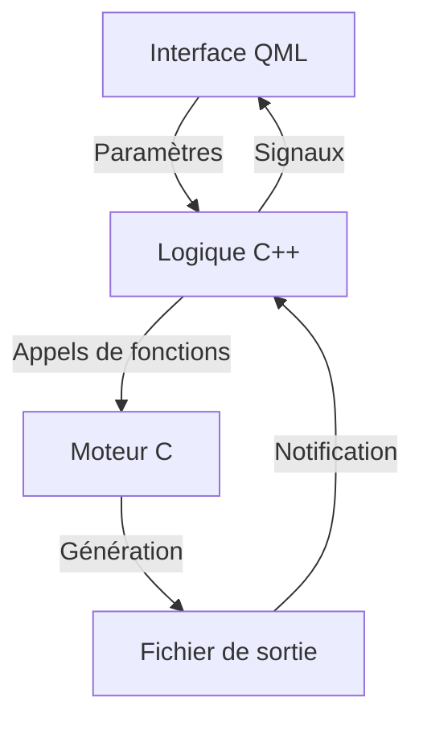
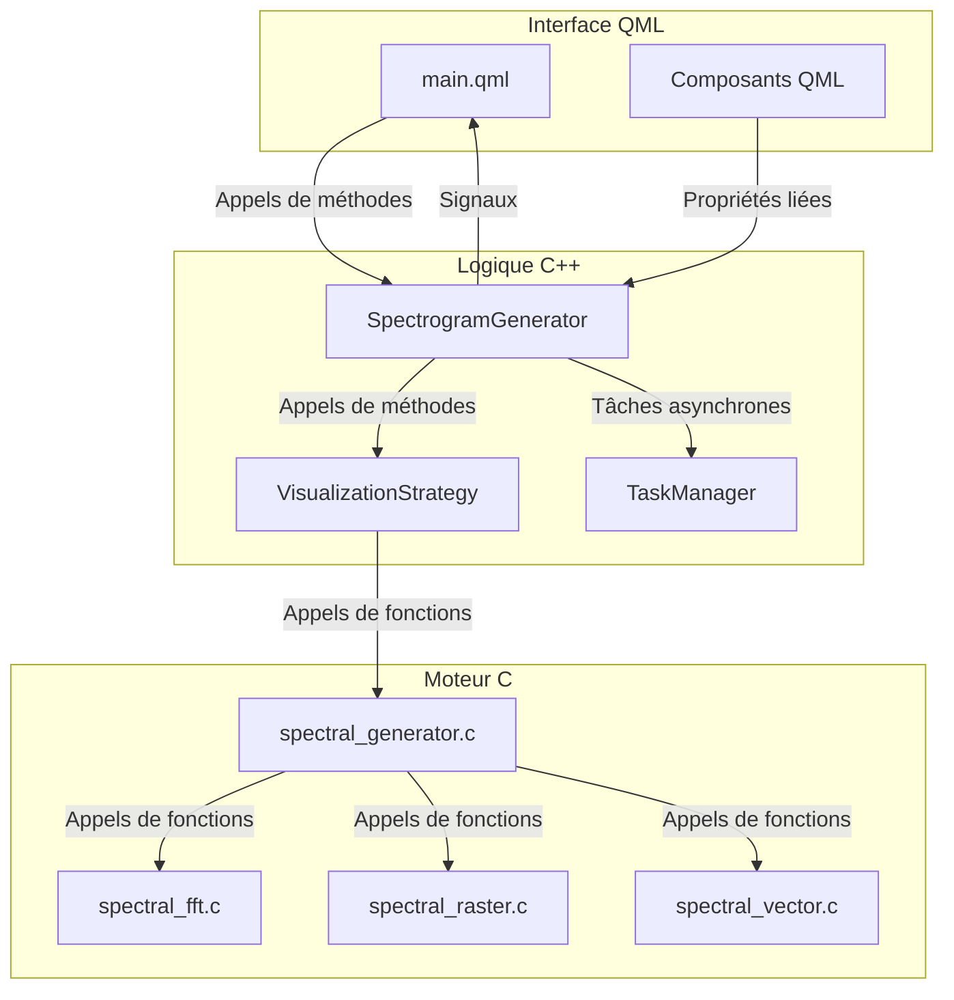
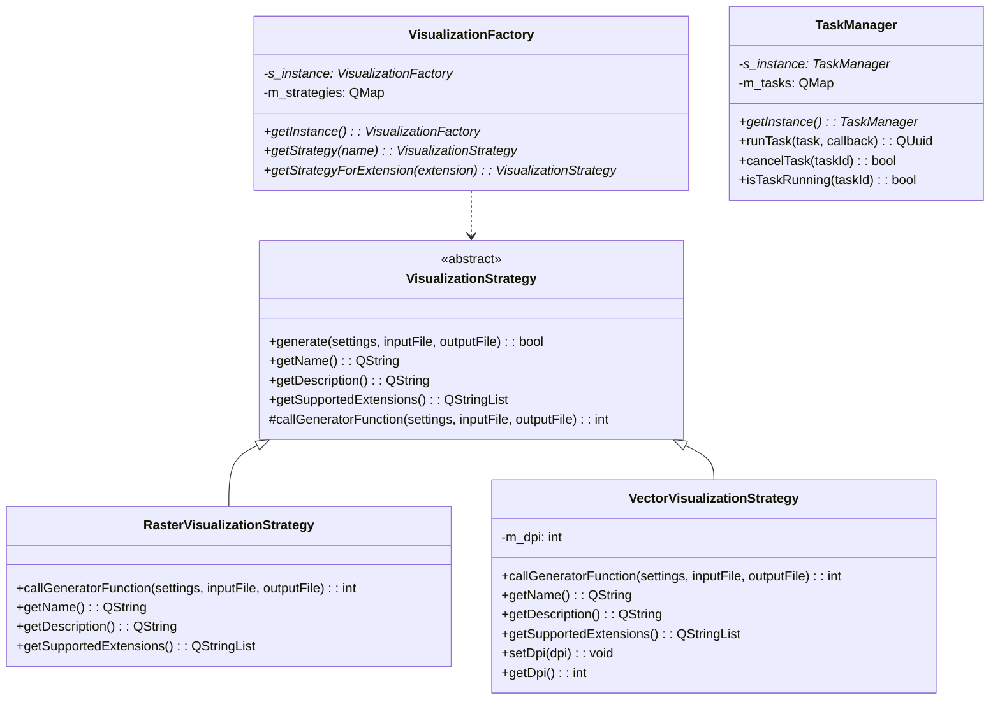

# Architecture et patterns de conception

## Architecture en trois couches

L'architecture du projet Sp3ctraGen est basée sur une séparation claire entre trois couches distinctes, chacune ayant des responsabilités spécifiques. Cette séparation permet une meilleure maintenabilité et une évolution indépendante de chaque couche.

```
┌─────────────────┐
│  Interface QML  │
└────────┬────────┘
         │
         ▼
┌─────────────────┐
│  Logique C++    │
└────────┬────────┘
         │
         ▼
┌─────────────────┐
│  Moteur C       │
└─────────────────┘
```

### 1. Interface utilisateur (QML)

La couche d'interface utilisateur est implémentée en QML (Qt Quick Markup Language) et est responsable de:

- Présenter l'interface graphique à l'utilisateur
- Collecter les paramètres de génération du spectrogramme
- Afficher les prévisualisations et les résultats
- Communiquer avec la couche logique métier

**Fichiers clés:**
- `qml/main.qml` - Interface principale
- `qml/main_with_preview.qml` - Interface avec prévisualisation
- `qml/components/` - Composants réutilisables

### 2. Logique métier (C++)

La couche de logique métier est implémentée en C++ et sert d'intermédiaire entre l'interface utilisateur et le moteur de traitement:

- Validation des paramètres d'entrée
- Coordination des opérations de génération
- Gestion des tâches asynchrones
- Implémentation des stratégies de visualisation

**Fichiers clés:**
- `include/SpectrogramGenerator.h` et `src/SpectrogramGenerator.cpp` - Classe principale
- `include/VisualizationStrategy.h` et `src/VisualizationStrategy.cpp` - Interface de stratégie
- `include/TaskManager.h` et `src/TaskManager.cpp` - Gestion des tâches asynchrones

### 3. Moteur de traitement (C)

Le moteur de traitement est implémenté en C et est responsable des opérations intensives de calcul:

- Chargement et prétraitement des fichiers audio
- Analyse FFT et traitement spectral
- Génération des images de spectrogramme
- Optimisations pour l'impression et la numérisation

**Fichiers clés:**
- `src/spectral_generator.c` - Point d'entrée du moteur
- `src/spectral_fft.c` - Traitement FFT
- `src/spectral_raster.c` - Génération d'images raster
- `src/spectral_vector.c` - Génération d'images vectorielles
- `src/spectral_wav_processing.c` - Traitement des fichiers audio

## Patterns de conception utilisés

Sp3ctraGen utilise plusieurs patterns de conception pour améliorer la modularité, la maintenabilité et l'extensibilité du code.

### 1. Pattern Strategy

Le pattern Strategy est utilisé pour encapsuler différentes implémentations de génération de spectrogrammes:

```
┌───────────────────────┐
│ VisualizationStrategy │
│   (classe abstraite)  │
└───────────┬───────────┘
            │
            ├─────────────────────┐
            │                     │
┌───────────▼───────────┐ ┌───────▼───────────────┐
│RasterVisualizationStrategy│ │VectorVisualizationStrategy│
└───────────────────────┘ └─────────────────────────┘
```

Ce pattern permet d'ajouter facilement de nouveaux formats de sortie sans modifier le code existant. Chaque stratégie implémente une méthode spécifique pour générer un type particulier de spectrogramme (PNG, PDF, etc.).

**Implémentation:**
- `include/VisualizationStrategy.h` - Interface de stratégie
- `include/RasterVisualizationStrategy.h` - Stratégie pour PNG
- `include/VectorVisualizationStrategy.h` - Stratégie pour PDF

### 2. Pattern Template Method

Le pattern Template Method est utilisé dans la classe `VisualizationStrategy` pour définir le squelette de l'algorithme de génération de spectrogrammes, tout en permettant aux sous-classes de redéfinir certaines étapes:

```cpp
// Méthode template dans la classe de base
bool VisualizationStrategy::generate(const SpectrogramSettingsCpp& settings, 
                                   const QString& inputFile,
                                   const QString& outputFile)
{
    // Étapes communes
    // ...
    
    // Exécuter la génération dans un thread séparé
    QFuture<void> future = QtConcurrent::run([=]() {
        this->runGeneration(cSettings, inputFile, outputFile);
    });
    
    return true;
}

// Méthode abstraite à implémenter par les sous-classes
virtual int callGeneratorFunction(const SpectrogramSettings& settings,
                                const char* inputFile,
                                const char* outputFile) = 0;
```

Ce pattern permet de factoriser le code commun tout en permettant aux sous-classes de personnaliser certaines étapes spécifiques.

### 3. Pattern Singleton

Le pattern Singleton est utilisé pour les classes utilitaires qui n'ont besoin que d'une seule instance:

- `QmlConstants`: Exposé comme singleton à QML
- `PathManager`: Utilise des méthodes statiques
- `TaskManager`: Gestion des tâches asynchrones
- `VisualizationFactory`: Fabrique de stratégies de visualisation

**Exemple d'implémentation:**
```cpp
class TaskManager : public QObject
{
    Q_OBJECT
    
public:
    static TaskManager* getInstance();
    
private:
    explicit TaskManager(QObject *parent = nullptr);
    ~TaskManager();
    
    static TaskManager* s_instance; // Instance unique (Singleton)
};
```

### 4. Pattern Factory

Le pattern Factory est utilisé pour créer des instances de stratégies de visualisation:

```cpp
class VisualizationFactory : public QObject
{
    Q_OBJECT
    
public:
    static VisualizationFactory* getInstance();
    VisualizationStrategy* getStrategy(const QString& name);
    VisualizationStrategy* getStrategyForExtension(const QString& extension);
    
private:
    explicit VisualizationFactory(QObject *parent = nullptr);
    ~VisualizationFactory();
    
    void initializeStrategies();
    
    static VisualizationFactory* s_instance;
    QMap<QString, VisualizationStrategy*> m_strategies;
};
```

Ce pattern permet de centraliser la création des stratégies et de les sélectionner en fonction du format de sortie souhaité.

### 5. Pattern Composite

Le pattern Composite est utilisé dans l'interface utilisateur QML pour construire des interfaces complexes à partir de composants simples:

- `AnimatedButton`: Composant de bouton réutilisable
- `ValidatedTextField`: Composant de champ de texte réutilisable

## Principes de conception appliqués

### 1. DRY (Don't Repeat Yourself)

Le principe DRY a été appliqué pour éliminer la duplication de code et de constantes:

- Centralisation des constantes dans `SharedConstants.h`
- Extraction du code commun dans les classes de base
- Création de composants QML réutilisables

### 2. Séparation des préoccupations (Separation of Concerns)

Chaque composant a une responsabilité unique et bien définie:

- **Interface utilisateur**: Présentation et interaction avec l'utilisateur
- **Logique métier**: Coordination des opérations et gestion des données
- **Moteur de traitement**: Algorithmes de traitement du signal et génération de spectrogrammes

### 3. Principe ouvert/fermé (Open/Closed Principle)

Les composants sont conçus pour être ouverts à l'extension mais fermés à la modification:

- Utilisation de classes abstraites et d'interfaces
- Implémentation du pattern Strategy pour les différentes visualisations
- Composants QML paramétrables

## Diagrammes d'architecture

### Flux de données

Le flux de données dans l'application suit le chemin suivant:



### Communication entre les couches



### Structure des classes



## Conclusion

L'architecture de Sp3ctraGen est basée sur des principes de conception solides et des patterns éprouvés. Elle offre une séparation claire des préoccupations, une réutilisation maximale du code et une extensibilité pour les évolutions futures. Les patterns de conception utilisés permettent d'ajouter facilement de nouvelles fonctionnalités sans modifier le code existant, ce qui facilite la maintenance et l'évolution du projet.