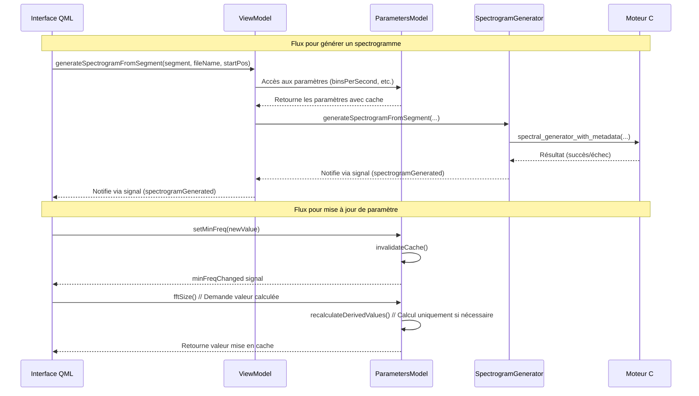
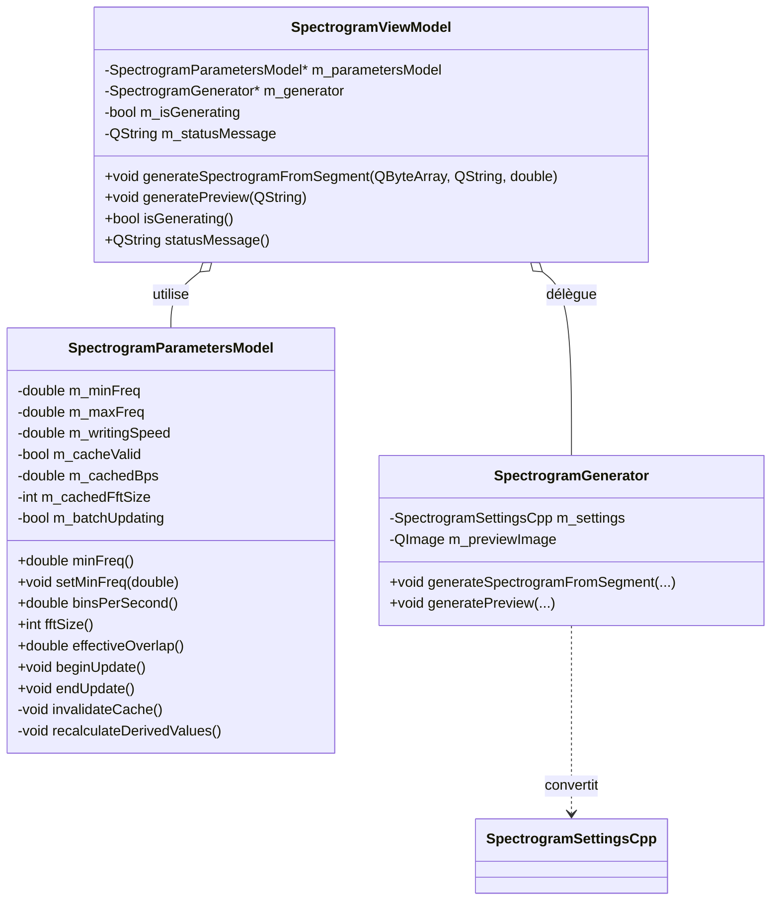

# Schéma de l'architecture MVVM de Sp3ctraGen

## Architecture générale

```mermaid
graph TD
    %% Définition des styles
    classDef qmlLayer fill:#629,stroke:#333,stroke-width:2px;
    classDef viewModelLayer fill:#879,stroke:#333,stroke-width:2px;
    classDef modelLayer fill:#244,stroke:#333,stroke-width:2px;
    classDef cppLayer fill:#968,stroke:#333,stroke-width:2px;
    classDef cLayer fill:#925,stroke:#333,stroke-width:2px;

    %% Couche QML (Vue)
    QML[Interface QML \n main.qml + components] 
    QMLParams[SpectrogramParameters.qml]
    QMLFilter[FilterParameters.qml]
    QMLOutput[OutputFormat.qml]
    QMLAudio[AudioWaveformSection.qml]
    QMLPreview[PreviewSection.qml]

    %% Couche ViewModel (C++)
    VM[SpectrogramViewModel]

    %% Couche Modèle (C++)
    PM[SpectrogramParametersModel]

    %% Couche Logique C++
    SG[SpectrogramGenerator]
    VS[VisualizationStrategy]
    WF[WaveformProvider]
    IP[ImageProviders]
    TM[TaskManager]

    %% Couche Moteur C
    specgen[spectral_generator.c]
    specfft[spectral_fft.c]
    specvec[spectral_vector.c]
    specrast[spectral_raster.c]
    specwave[spectral_wav_processing.c]

    %% Connexions entre composants QML
    QML --> QMLParams
    QML --> QMLFilter
    QML --> QMLOutput
    QML --> QMLAudio
    QML --> QMLPreview

    %% Connexions QML -> ViewModel
    QMLParams -.->|Binding| VM
    QMLFilter -.->|Binding| VM
    QMLOutput -.->|Binding| VM
    QMLAudio -->|Extraction audio| VM
    QMLPreview -->|Actions utilisateur| VM

    %% Connexions QML -> Modèle
    QMLParams -.->|Binding| PM
    QMLFilter -.->|Binding| PM
    QMLOutput -.->|Binding| PM

    %% Connexions ViewModel -> Model
    VM -->|Accès et modification| PM

    %% Connexions ViewModel -> Logic C++
    VM -->|Délégation des appels| SG
    VM -->|Gestion tâches| TM
    
    %% Connexions Logic C++ -> Logic C++
    SG -->|Stratégie| VS
    SG -->|Tâches asynchrones| TM
    SG -->|Preview| IP
    
    %% Connexions Model -> Logic C++
    PM -.->|Structure de paramètres| SG

    %% Connexions Logic C++ -> Moteur C
    SG -->|Appels C| specgen
    VS -->|Appels C| specvec
    VS -->|Appels C| specrast
    WF -->|Appels C| specwave
    
    %% Connexions internes du Moteur C
    specgen -->|FFT| specfft
    specgen -->|Raster| specrast
    specgen -->|Vector| specvec
    specgen -->|Wave| specwave

    %% Application des styles
    class QML,QMLParams,QMLFilter,QMLOutput,QMLAudio,QMLPreview qmlLayer;
    class VM viewModelLayer;
    class PM modelLayer;
    class SG,VS,WF,IP,TM cppLayer;
    class specgen,specfft,specvec,specrast,specwave cLayer;
```



## Flux de données



## Structure du modèle de paramètres



## Implémentation du mécanisme de cache

```mermaid
graph TD
    A[UI modifie un paramètre] -->|setMinFreq()| B{Valeur différente?}
    B -->|Non| Z[Fin sans action]
    B -->|Oui| C[Mettre à jour m_minFreq]
    C --> D[Émettre minFreqChanged]
    D --> E[emitChangeSignal(true)]
    
    E --> F{m_batchUpdating\nest true?}
    F -->|Oui| G[Marquer m_paramsChanged = true]
    F -->|Non| H[invalidateCache()]
    H --> I[Émettre parametersChanged]
    
    J[UI demande une valeur\ncalculée: fftSize()] --> K{m_cacheValid\nest true?}
    K -->|Oui| L[Retourner m_cachedFftSize]
    K -->|Non| M[recalculateDerivedValues()]
    M --> N[Calculer binsPerSecond, fftSize, overlap]
    N --> O[Stocker résultats en cache]
    O --> P[m_cacheValid = true]
    P --> Q[Émettre signaux de changement]
    Q --> R[Retourner valeur calculée]
    
    S[UI appelle beginUpdate()] --> T[m_batchUpdating = true]
    U[UI appelle endUpdate()] --> V{m_batchUpdating\nest true?}
    V -->|Oui| W[m_batchUpdating = false]
    W --> X{m_paramsChanged\nest true?}
    X -->|Oui| Y[m_paramsChanged = false]
    Y --> H
```

## Flux d'interaction avec l'utilisateur

```mermaid
sequenceDiagram
    participant User as Utilisateur
    participant QML as Interface QML
    participant VM as ViewModel
    participant PM as ParametersModel
    
    User->>QML: Modifie la fréquence minimum
    QML->>PM: setMinFreq(newValue)
    PM->>PM: Invalider le cache
    PM-->>QML: minFreqChanged signal
    
    User->>QML: Modifie la vitesse d'écriture
    QML->>PM: setWritingSpeed(newValue)
    PM->>PM: Invalider le cache
    PM-->>QML: writingSpeedChanged signal
    
    User->>QML: Demande la génération
    QML->>VM: generateSpectrogramFromSegment(...)
    VM->>PM: Accès binsPerSecond (déclenche calcul)
    PM->>PM: Calcul et mise en cache
    PM-->>VM: Valeur calculée
    VM-->>QML: isGeneratingChanged signal (true)
    
    Note over User,PM: Les calculs ne sont effectués qu'une seule fois au moment où les valeurs sont nécessaires
