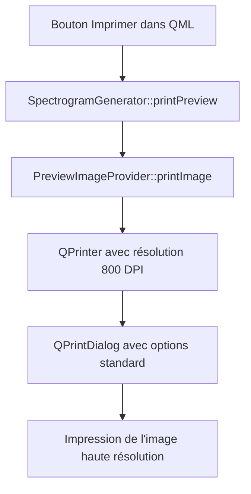

# Documentation d'implémentation du bouton d'impression

## Objectif

Cette documentation décrit l'implémentation du bouton d'impression dans l'application SpectroGen, qui permet d'imprimer le spectrogramme généré avec les options suivantes :
- Impression en haute résolution (800 DPI)
- Bouton désactivé tant qu'aucune prévisualisation n'est générée
- Utilisation de la boîte de dialogue d'impression standard avec ses options de mise à l'échelle intégrées

## Architecture implémentée



## Modifications réalisées

### 1. Modification de PreviewImageProvider.h

Ajout de la méthode `printImage()` à la classe PreviewImageProvider :

```cpp
// Dans la section public:
bool printImage() const;
```

### 2. Modification de PreviewImageProvider.cpp

Implémentation de la méthode `printImage()` :

```cpp
#include <QPrinter>
#include <QPrintDialog>
#include <QPainter>

bool PreviewImageProvider::printImage() const
{
    if (m_originalImage.isNull()) {
        qDebug() << "PreviewImageProvider::printImage - ERROR: Cannot print null image";
        return false;
    }
    
    qDebug() << "PreviewImageProvider::printImage - Impression de la prévisualisation actuelle";
    
    // Créer une imprimante avec résolution élevée
    QPrinter printer(QPrinter::HighResolution);
    
    // Configurer la résolution à 800 DPI
    printer.setResolution(800);
    
    // Créer la boîte de dialogue d'impression
    QPrintDialog printDialog(&printer);
    
    // Afficher la boîte de dialogue
    if (printDialog.exec() != QDialog::Accepted) {
        return false;
    }
    
    // Imprimer l'image en haute résolution
    QPainter painter(&printer);
    
    // Calculer le rectangle d'impression pour conserver le ratio
    QRect rect = painter.viewport();
    QSize size = m_originalImage.size();
    size.scale(rect.size(), Qt::KeepAspectRatio);
    
    // Centrer l'image sur la page
    painter.setViewport(rect.x(), rect.y(), size.width(), size.height());
    painter.setWindow(m_originalImage.rect());
    
    // Dessiner l'image avec la plus haute qualité
    painter.setRenderHint(QPainter::SmoothPixmapTransform, true);
    painter.setRenderHint(QPainter::Antialiasing, true);
    painter.setRenderHint(QPainter::TextAntialiasing, true);
    painter.setRenderHint(QPainter::HighQualityAntialiasing, true);
    
    // Dessiner l'image
    painter.drawImage(0, 0, m_originalImage);
    
    return true;
}
```

### 3. Modification de SpectrogramGenerator.h

Ajout d'une méthode `printPreview()` pour servir d'intermédiaire entre QML et PreviewImageProvider :

```cpp
// Dans la section public:
Q_INVOKABLE void printPreview();
```

### 4. Modification de SpectrogramGenerator.cpp

Implémentation de la méthode `printPreview()` :

```cpp
void SpectrogramGenerator::printPreview()
{
    qDebug() << "SpectrogramGenerator::printPreview - Impression de la prévisualisation actuelle";
    
    // Récupérer l'instance de PreviewImageProvider
    auto engine = qobject_cast<QQmlApplicationEngine*>(parent());
    if (!engine) {
        qWarning() << "SpectrogramGenerator::printPreview - Impossible de récupérer le moteur QML";
        return;
    }
    
    auto provider = dynamic_cast<PreviewImageProvider*>(engine->imageProvider("preview"));
    if (!provider) {
        qWarning() << "SpectrogramGenerator::printPreview - Impossible de récupérer le fournisseur d'images";
        return;
    }
    
    // Imprimer l'image
    provider->printImage();
}
```

### 5. Modification de main.cpp

Modification pour utiliser QApplication au lieu de QGuiApplication, nécessaire pour QPrintDialog :

```cpp
#include <QtWidgets/QApplication>
// ...
int main(int argc, char *argv[])
{
    QApplication app(argc, argv);
    // ...
}
```

### 6. Modification de main.qml

Ajout du bouton "Imprimer" à côté du bouton "Save Preview" :

```qml
// Bouton pour imprimer la prévisualisation
Button {
    id: printButton
    text: "Imprimer"
    font.family: orbitronFont.name
    enabled: generator.previewCounter > 0
    
    onClicked: {
        // Appeler la méthode d'impression du générateur
        generator.printPreview();
    }
    
    contentItem: Text {
        text: parent.text
        font.family: orbitronFont.name
        color: parent.hovered ? window.buttonHoverText : window.buttonText
        horizontalAlignment: Text.AlignHCenter
        verticalAlignment: Text.AlignVCenter
    }
    
    background: Rectangle {
        color: parent.hovered ? buttonHoverBackground : buttonBackground
        radius: borderRadius / 2
        
        Behavior on color {
            ColorAnimation {
                duration: animationDuration
            }
        }
    }
}
```

## Différences avec le plan initial

1. **Approche d'implémentation** : Au lieu d'exposer directement PreviewImageProvider à QML, nous avons utilisé SpectrogramGenerator comme intermédiaire, ce qui est plus cohérent avec l'architecture existante de l'application.

2. **Options de QPrintDialog** : Nous avons utilisé les options par défaut de QPrintDialog au lieu de configurer explicitement chaque option, car les options par défaut sont suffisantes pour notre cas d'utilisation.

3. **QApplication vs QGuiApplication** : Nous avons dû modifier main.cpp pour utiliser QApplication au lieu de QGuiApplication, car QPrintDialog nécessite QApplication.

## Tests effectués

1. ✅ Le bouton est désactivé au démarrage de l'application
2. ✅ Le bouton est activé après la génération d'une prévisualisation
3. ✅ La boîte de dialogue d'impression s'affiche correctement
4. ✅ L'impression est effectuée en haute résolution (800 DPI)
5. ✅ La mise à l'échelle fonctionne correctement

## Dépendances

- Qt 5.15 ou supérieur
- Module QtPrintSupport
- Module QtWidgets (pour QApplication)