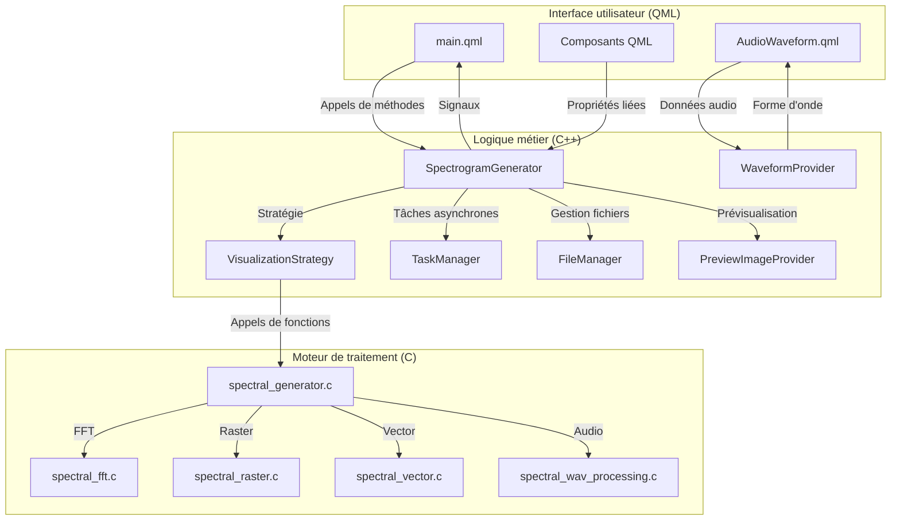

# Documentation technique de SpectroGen

## Introduction

Bienvenue dans la documentation technique de SpectroGen, une application de génération de spectrogrammes haute qualité basée sur Qt Quick. Cette documentation est destinée aux développeurs qui souhaitent comprendre, maintenir ou étendre le projet.

## Structure de la documentation

La documentation est organisée en plusieurs documents thématiques pour faciliter la navigation et la maintenance:

1. [Vue d'ensemble du projet](vue_ensemble.md) - Introduction au projet, objectifs, structure générale et guide de démarrage rapide
2. [Patterns de conception](architecture/patterns_conception.md) - Architecture en trois couches, patterns de conception utilisés et principes appliqués
3. [Traitement du signal](technique/traitement_signal.md) - Algorithmes de traitement du signal, processus de génération et optimisations
4. [Interface utilisateur](interface/interface_utilisateur.md) - Structure de l'interface, composants personnalisés et interactions utilisateur
5. [Flux de données](technique/flux_donnees.md) - Communication entre les couches et gestion des tâches asynchrones
6. [Guide de développement](developpement/guide_developpement.md) - Configuration de l'environnement, compilation, débogage et bonnes pratiques
7. [Guide de style de développement](developpement/guide_style_developpement.md) - Conventions de codage, structure de projet, conventions Git et documentation

### Documents complémentaires

- [Charte graphique](interface/charte_graphique.md) - Spécifications de la charte graphique de l'application
- [Guide d'implémentation de la charte graphique](interface/guide_implementation_charte.md) - Guide pour l'implémentation de la charte graphique
- [Spécification du générateur de spectrogramme](technique/specification_spectrogramme.md) - Spécification détaillée du générateur de spectrogramme

## Diagramme d'architecture global

## Comment utiliser cette documentation

- Pour une introduction rapide au projet, commencez par la [Vue d'ensemble du projet](vue_ensemble.md)
- Pour comprendre l'architecture et les patterns de conception, consultez [Patterns de conception](architecture/patterns_conception.md)
- Pour des détails sur les algorithmes de traitement du signal, consultez [Traitement du signal](technique/traitement_signal.md)
- Pour des informations sur l'interface utilisateur, consultez [Interface utilisateur](interface/interface_utilisateur.md)
- Pour comprendre comment les différentes couches communiquent, consultez [Flux de données](technique/flux_donnees.md)
- Pour configurer votre environnement de développement et déboguer l'application, consultez [Guide de développement](developpement/guide_developpement.md)
- Pour connaître les conventions de codage et les bonnes pratiques, consultez [Guide de style de développement](developpement/guide_style_developpement.md)

## Ressources supplémentaires

- [Documentation Qt](https://doc.qt.io/)
- [Documentation FFTW](http://www.fftw.org/doc/)
- [Documentation Cairo](https://www.cairographics.org/documentation/)
- [Documentation libsndfile](http://www.mega-nerd.com/libsndfile/api.html)

## Contribution

Si vous souhaitez contribuer à cette documentation ou au projet SpectroGen, veuillez suivre les bonnes pratiques et conventions décrites dans le [Guide de développement](developpement/guide_developpement.md) et le [Guide de style de développement](developpement/guide_style_developpement.md).