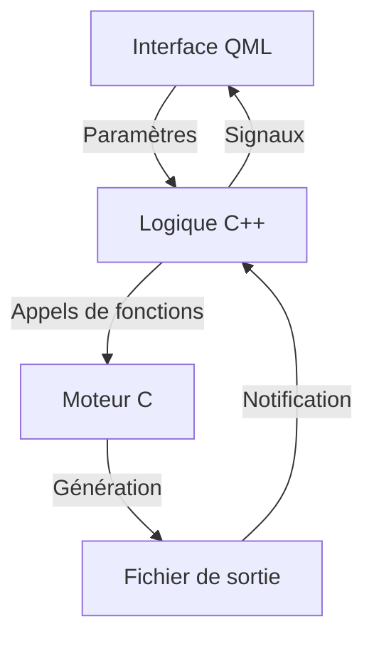
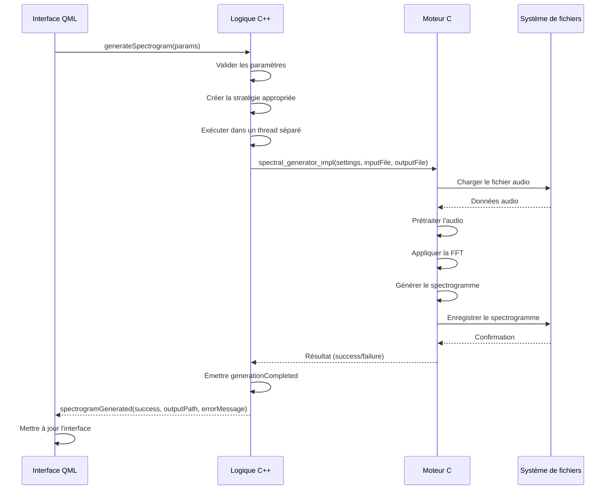

# Flux de données et communication entre couches

## Introduction

Sp3ctraGen est structuré selon une architecture en trois couches distinctes: l'interface utilisateur (QML), la logique métier (C++) et le moteur de traitement (C). Cette documentation détaille les mécanismes de communication entre ces couches et le flux de données à travers l'application.

## Vue d'ensemble du flux de données

Le flux de données dans Sp3ctraGen suit généralement le chemin suivant:



1. L'utilisateur configure les paramètres via l'interface QML
2. Les paramètres sont transmis à la couche logique C++
3. La couche C++ valide les paramètres et les transmet au moteur C
4. Le moteur C génère le spectrogramme et l'enregistre dans un fichier
5. Le résultat est transmis à la couche C++
6. La couche C++ notifie l'interface QML du résultat

## Communication QML → C++

La communication de l'interface QML vers la couche C++ se fait principalement via deux mécanismes:

### 1. Appels de méthodes

QML peut appeler directement des méthodes C++ exposées via le système de méta-objets de Qt:

```qml
// Appel de méthode C++ depuis QML
Button {
    onClicked: {
        generator.generateSpectrogram(
            parseInt(fftSizeField.text),
            parseFloat(overlapField.text),
            // ... autres paramètres ...
            inputFileField.text,
            outputFolderField.text,
            normalizationToggle.checked
        )
    }
}
```

Ces méthodes sont exposées dans la classe C++ avec la macro `Q_INVOKABLE` ou en tant que slots:

```cpp
class SpectrogramGenerator : public QObject
{
    Q_OBJECT
    
public slots:
    void generateSpectrogram(
        int fftSize,
        double overlap,
        double minFreq,
        double maxFreq,
        double duration,
        int sampleRate,
        double dynamicRangeDB,
        double gammaCorrection,
        bool enableDithering,
        double contrastFactor,
        bool enableHighBoost,
        double highBoostAlpha,
        bool enableHighPassFilter,
        double highPassCutoffFreq,
        int highPassFilterOrder,
        int pageFormat,
        double bottomMarginMM,
        double spectroHeightMM,
        double writingSpeed,
        const QString& inputFile,
        const QString& outputFolder,
        bool enableNormalization = true
    );
    
    // ...
};
```

### 2. Propriétés liées

QML peut se lier à des propriétés C++ exposées via le système de propriétés de Qt:

```qml
// Liaison de propriété QML à une propriété C++
Text {
    text: generator.statusMessage
    color: generator.isGenerating ? "#FFCC00" : "#FFFFFF"
}
```

Ces propriétés sont exposées dans la classe C++ avec la macro `Q_PROPERTY`:

```cpp
class SpectrogramGenerator : public QObject
{
    Q_OBJECT
    Q_PROPERTY(QString statusMessage READ statusMessage NOTIFY statusMessageChanged)
    Q_PROPERTY(bool isGenerating READ isGenerating NOTIFY isGeneratingChanged)
    
public:
    QString statusMessage() const { return m_statusMessage; }
    bool isGenerating() const { return m_isGenerating; }
    
signals:
    void statusMessageChanged();
    void isGeneratingChanged();
    
private:
    QString m_statusMessage;
    bool m_isGenerating;
};
```

## Communication C++ → QML

La communication de la couche C++ vers l'interface QML se fait principalement via deux mécanismes:

### 1. Signaux

C++ peut émettre des signaux que QML peut connecter à des gestionnaires d'événements:

```cpp
class SpectrogramGenerator : public QObject
{
    Q_OBJECT
    
signals:
    void spectrogramGenerated(bool success, const QString& outputPath, const QString& errorMessage);
    void progressUpdated(int progress, const QString& message);
    void previewGenerated(bool success, const QString& errorMessage);
    
    // ...
};
```

QML se connecte à ces signaux via la syntaxe `on<SignalName>`:

```qml
SpectrogramGenerator {
    id: generator
    
    onSpectrogramGenerated: {
        console.log("Signal spectrogramGenerated received: success=" + success + ", outputPath=" + outputPath);
        
        // Arrêter l'animation de traitement
        generateButton.stopProcessingAnimation()
        
        if (success) {
            statusText.text = "Spectrogram successfully generated: " + outputPath
            statusText.color = successColor
            generateButton.startSuccessAnimation()
        } else {
            statusText.text = "Error generating spectrogram: " + errorMessage
            statusText.color = errorColor
        }
    }
    
    onProgressUpdated: {
        progressBar.value = progress / 100.0
        progressText.text = message
    }
    
    onPreviewGenerated: {
        // ...
    }
}
```

### 2. Propriétés notifiables

C++ peut modifier des propriétés qui notifient QML des changements:

```cpp
void SpectrogramGenerator::setIsGenerating(bool isGenerating)
{
    if (m_isGenerating != isGenerating) {
        m_isGenerating = isGenerating;
        emit isGeneratingChanged();
    }
}

void SpectrogramGenerator::setStatusMessage(const QString& statusMessage)
{
    if (m_statusMessage != statusMessage) {
        m_statusMessage = statusMessage;
        emit statusMessageChanged();
    }
}
```

QML réagit automatiquement aux changements de ces propriétés grâce au système de liaison de propriétés de Qt.

## Communication C++ → C

La communication de la couche C++ vers le moteur C se fait via des appels de fonctions C standard:

### 1. Appels de fonctions

C++ appelle directement les fonctions C exportées:

```cpp
int RasterVisualizationStrategy::callGeneratorFunction(const SpectrogramSettings& settings,
                                                     const char* inputFile,
                                                     const char* outputFile)
{
    qDebug() << "Appel de spectral_generator_impl pour la génération du spectrogramme raster";
    return spectral_generator_impl(&settings, inputFile, outputFile);
}

int VectorVisualizationStrategy::callGeneratorFunction(const SpectrogramSettings& settings,
                                                     const char* inputFile,
                                                     const char* outputFile)
{
    qDebug() << "Appel de spectral_generator_vector_pdf_impl pour la génération du PDF vectoriel";
    qDebug() << "Résolution: " << m_dpi << " DPI";
    return spectral_generator_vector_pdf_impl(&settings, inputFile, outputFile, m_dpi);
}
```

Ces fonctions sont déclarées dans les fichiers d'en-tête C avec la directive `extern "C"` pour éviter la décoration des noms C++:

```cpp
// Dans spectral_generator.h
#ifdef __cplusplus
extern "C" {
#endif

// Structure for spectrogram settings
typedef struct SpectrogramSettings
{
    int     fftSize;
    double  overlap;
    double  minFreq;
    double  maxFreq;
    double  duration;
    int     sampleRate;
    double  dynamicRangeDB;
    double  gammaCorrection;
    int     enableDithering;
    double  contrastFactor;
    int     enableHighBoost;
    double  highBoostAlpha;
    int     pageFormat;
    double  bottomMarginMM;
    double  spectroHeightMM;
    double  writingSpeed;
    int     enableHighPassFilter;
    double  highPassCutoffFreq;
    int     highPassFilterOrder;
    int     enableNormalization;
} SpectrogramSettings;

// C function we want to call from C++
int spectral_generator(const SpectrogramSettings *cfg,
                       const char *inputFile,
                       const char *outputFile);

// C function for vector PDF generation with custom DPI
int spectral_generator_vector_pdf(const SpectrogramSettings *cfg,
                                 const char *inputFile,
                                 const char *outputFile,
                                 int dpi);

#ifdef __cplusplus
}
#endif
```

### 2. Structures de données

C++ passe des structures de données à C:

```cpp
SpectrogramSettings SpectrogramSettingsCpp::toCStruct() const
{
    SpectrogramSettings settings;
    
    settings.fftSize = m_fftSize;
    settings.overlap = m_overlap;
    settings.minFreq = m_minFreq;
    settings.maxFreq = m_maxFreq;
    settings.duration = m_duration;
    settings.sampleRate = m_sampleRate;
    settings.dynamicRangeDB = m_dynamicRangeDB;
    settings.gammaCorrection = m_gammaCorrection;
    settings.enableDithering = m_enableDithering ? 1 : 0;
    settings.contrastFactor = m_contrastFactor;
    settings.enableHighBoost = m_enableHighBoost ? 1 : 0;
    settings.highBoostAlpha = m_highBoostAlpha;
    settings.pageFormat = m_pageFormat;
    settings.bottomMarginMM = m_bottomMarginMM;
    settings.spectroHeightMM = m_spectroHeightMM;
    settings.writingSpeed = m_writingSpeed;
    settings.enableHighPassFilter = m_enableHighPassFilter ? 1 : 0;
    settings.highPassCutoffFreq = m_highPassCutoffFreq;
    settings.highPassFilterOrder = m_highPassFilterOrder;
    settings.enableNormalization = m_enableNormalization ? 1 : 0;
    
    return settings;
}
```

## Gestion des tâches asynchrones

Sp3ctraGen utilise le `TaskManager` pour gérer les tâches asynchrones et éviter de bloquer l'interface utilisateur pendant les opérations longues:

```cpp
class TaskManager : public QObject
{
    Q_OBJECT
    
public:
    using TaskCallback = std::function<void(bool success, const QString& message)>;
    using ProgressCallback = std::function<void(int progress, const QString& message)>;
    
    static TaskManager* getInstance();
    
    QUuid runTask(std::function<void(ProgressCallback)> task, 
                 TaskCallback callback);
    
    bool cancelTask(const QUuid& taskId);
    void cancelAllTasks();
    bool isTaskRunning(const QUuid& taskId) const;
    int runningTaskCount() const;
    
signals:
    void taskStarted(const QUuid& taskId);
    void taskCompleted(const QUuid& taskId, bool success, const QString& message);
    void taskCancelled(const QUuid& taskId);
    void taskProgressUpdated(const QUuid& taskId, int progress, const QString& message);
    
private:
    explicit TaskManager(QObject *parent = nullptr);
    ~TaskManager();
    
    struct TaskInfo {
        QFutureWatcher<void>* watcher;
        TaskCallback callback;
        ProgressCallback progressCallback;
    };
    
    static TaskManager* s_instance;
    QMap<QUuid, TaskInfo> m_tasks;
};
```

Le `TaskManager` est utilisé par la classe `VisualizationStrategy` pour exécuter la génération du spectrogramme dans un thread séparé:

```cpp
bool VisualizationStrategy::generate(const SpectrogramSettingsCpp& settings,
                                   const QString& inputFile,
                                   const QString& outputFile)
{
    // Convertir les paramètres C++ en structure C
    SpectrogramSettings cSettings = settings.toCStruct();
    
    // Exécuter la génération dans un thread séparé
    QFuture<void> future = QtConcurrent::run([=]() {
        this->runGeneration(cSettings, inputFile, outputFile);
    });
    
    return true;
}

void VisualizationStrategy::runGeneration(const SpectrogramSettings& settings,
                                        const QString& inputFile,
                                        const QString& outputFile)
{
    // Convertir les chemins de fichiers en chaînes C
    QByteArray inputFileBytes = inputFile.toUtf8();
    QByteArray outputFileBytes = outputFile.toUtf8();
    const char* inputFileStr = inputFileBytes.constData();
    const char* outputFileStr = outputFileBytes.constData();
    
    // Appeler la fonction de génération spécifique à la stratégie
    int result = this->callGeneratorFunction(settings, inputFileStr, outputFileStr);
    
    // Émettre le signal de complétion
    if (result == EXIT_SUCCESS) {
        emit generationCompleted(true, outputFile);
    } else {
        emit generationCompleted(false, outputFile, "Error generating spectrogram");
    }
}
```

## Gestion des fichiers et des chemins

Sp3ctraGen utilise le `FileManager` et le `PathManager` pour gérer les opérations de fichiers et les chemins:

### FileManager

Le `FileManager` fournit des méthodes statiques pour gérer les opérations de fichiers:

```cpp
class FileManager {
public:
    static bool validateInputFile(const QString& path);
    static bool validateOutputDirectory(const QString& path);
    static bool ensureDirectoryExists(const QString& path);
    static QString getDefaultInputPath();
    static QString getDefaultOutputPath();
    static QString generateOutputFilename(const QString& outputFolder, 
                                         const QString& baseName,
                                         const QString& format);
};
```

Exemple d'implémentation:

```cpp
bool FileManager::validateInputFile(const QString& path)
{
    QFileInfo fileInfo(path);
    return fileInfo.exists() && fileInfo.isFile() && fileInfo.isReadable();
}

bool FileManager::validateOutputDirectory(const QString& path)
{
    QFileInfo dirInfo(path);
    return dirInfo.exists() && dirInfo.isDir() && QFileInfo(path).isWritable();
}

bool FileManager::ensureDirectoryExists(const QString& path)
{
    QDir dir(path);
    if (!dir.exists()) {
        return dir.mkpath(".");
    }
    return true;
}

QString FileManager::generateOutputFilename(const QString& outputFolder, 
                                          const QString& baseName,
                                          const QString& format)
{
    QDir dir(outputFolder);
    QString baseFileName = baseName.isEmpty() ? "spectrogram" : baseName;
    QString extension = format.startsWith(".") ? format : "." + format;
    
    // Ajouter un timestamp pour éviter les collisions
    QString timestamp = QDateTime::currentDateTime().toString("yyyyMMdd_hhmmss");
    
    return dir.filePath(baseFileName + "_" + timestamp + extension);
}
```

### PathManager

Le `PathManager` gère les chemins de fichiers et de dossiers:

```cpp
class PathManager {
public:
    static QString getApplicationDirPath();
    static QString getDocumentsPath();
    static QString getDefaultInputPath();
    static QString getDefaultOutputPath();
    static QString getResourcePath(const QString& resourceName);
    static QString getConfigPath();
    static QString getLogPath();
    static QString getTempPath();
};
```

Exemple d'implémentation:

```cpp
QString PathManager::getApplicationDirPath()
{
    return QCoreApplication::applicationDirPath();
}

QString PathManager::getDocumentsPath()
{
    return QStandardPaths::writableLocation(QStandardPaths::DocumentsLocation);
}

QString PathManager::getDefaultInputPath()
{
    // Chercher d'abord dans le dossier de l'application
    QString appDir = getApplicationDirPath();
    QDir dir(appDir);
    QStringList filters;
    filters << "*.wav";
    QStringList files = dir.entryList(filters, QDir::Files);
    
    if (!files.isEmpty()) {
        return dir.filePath(files.first());
    }
    
    // Sinon, retourner un chemin par défaut dans les documents
    return QDir(getDocumentsPath()).filePath("sample.wav");
}

QString PathManager::getDefaultOutputPath()
{
    return QDir(getDocumentsPath()).filePath("Sp3ctraGen");
}
```

## Flux de données complet pour la génération d'un spectrogramme

Voici le flux de données complet pour la génération d'un spectrogramme:

1. **Interface QML**: L'utilisateur configure les paramètres et clique sur le bouton "Generate Spectrogram"

2. **QML → C++**: Les paramètres sont transmis à la méthode `generateSpectrogram` de la classe `SpectrogramGenerator`

3. **Validation C++**: La classe `SpectrogramGenerator` valide les paramètres et les chemins de fichiers

4. **Création de la stratégie**: La classe `SpectrogramGenerator` utilise `VisualizationFactory` pour créer la stratégie appropriée (raster ou vectorielle)

5. **Exécution asynchrone**: La stratégie utilise `TaskManager` pour exécuter la génération dans un thread séparé

6. **C++ → C**: La stratégie appelle la fonction C appropriée (`spectral_generator_impl` ou `spectral_generator_vector_pdf_impl`)

7. **Traitement C**: Le moteur C charge le fichier audio, effectue l'analyse FFT, génère le spectrogramme et l'enregistre dans un fichier

8. **C → C++**: Le résultat est retourné à la stratégie

9. **Notification C++**: La stratégie émet un signal `generationCompleted`

10. **C++ → QML**: La classe `SpectrogramGenerator` émet un signal `spectrogramGenerated`

11. **Mise à jour QML**: L'interface QML affiche le résultat à l'utilisateur



## Conclusion

Le flux de données et la communication entre les couches dans Sp3ctraGen sont conçus pour être clairs, efficaces et robustes. La séparation des préoccupations entre les différentes couches permet une évolution indépendante de chaque composant, tout en maintenant une communication fluide entre eux.

Les mécanismes de communication utilisés (appels de méthodes, propriétés liées, signaux, etc.) sont des patterns standard de Qt qui facilitent le développement et la maintenance de l'application. La gestion asynchrone des tâches permet de maintenir une interface utilisateur réactive même pendant les opérations longues.

Cette architecture bien structurée permet à Sp3ctraGen d'être à la fois performant et maintenable, tout en offrant une expérience utilisateur fluide et réactive.