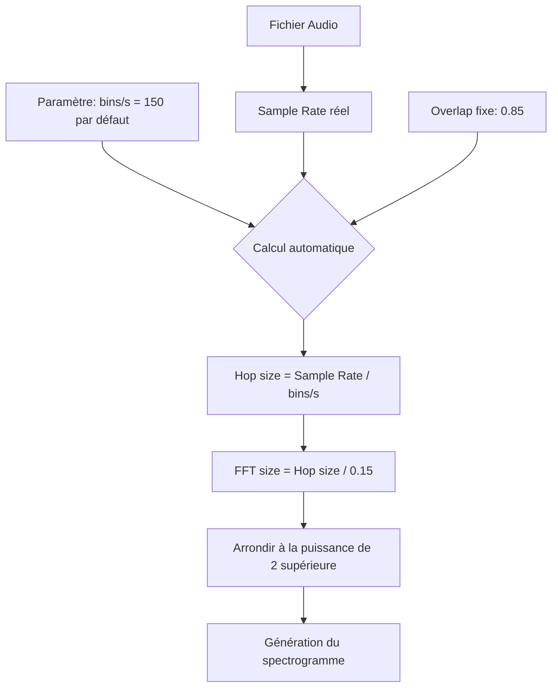
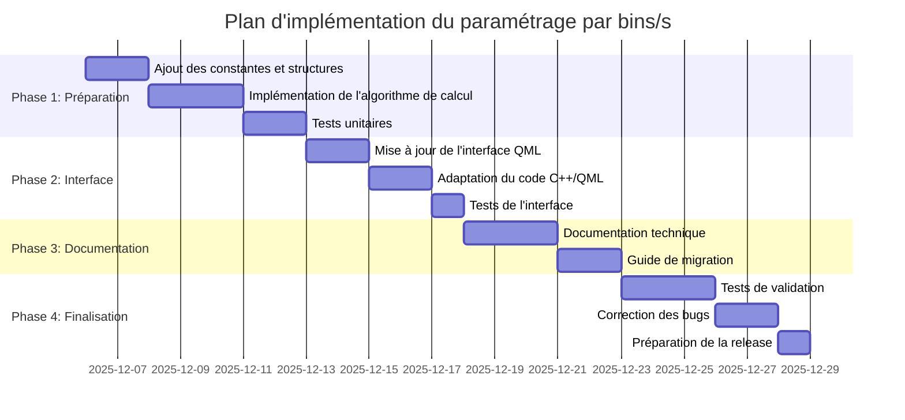

# Plan d'implémentation du paramétrage par bins/s dans Sp3ctraGen

## 1. Contexte et objectifs

L'objectif principal est d'optimiser le paramétrage de l'application en modifiant la FFT size pour l'exprimer en bin/s plutôt que dans sa configuration actuelle. Cette modification permettra que seuls le Window Size (WS) et le format papier déterminent la durée du segment audio analysé.

### 1.1 État actuel

Actuellement, le système utilise:
- Une FFT size fixe (8192 échantillons par défaut)
- Un taux d'échantillonnage fixe de 192 kHz 
- Un overlap de 0,85
- Une vitesse d'écriture (writingSpeed) en cm/s qui détermine la durée visible

La résolution fréquentielle actuelle est:
- Résolution = sample_rate / fft_size = 192000 / 8192 ≈ 23,4 Hz par bin

### 1.2 Problématique identifiée

Avec la configuration actuelle:
- La FFT size est indépendante de la vitesse d'écriture
- La densité temporelle des fenêtres FFT varie en fonction de la vitesse d'écriture
- Le contenu spectral peut apparaître trop condensé ou trop étiré selon les paramètres

### 1.3 Concept des bin/s

Notre approche optimisée sera d'exprimer la FFT en "bin/s" (bins par seconde), où:
- Un bin/s représente le nombre de colonnes spectrales par seconde d'audio
- Cette valeur détermine directement la densité d'information temporelle du spectrogramme
- Avec cette approche, seuls la Window Size et le format papier déterminent la durée analysée

## 2. Résumé conceptuel de la nouvelle approche



## 3. Modifications techniques détaillées

### 3.1 Modification des constantes

**Fichier: include/SharedConstants.h**

```c
// Ajouter la nouvelle constante
#define DEFAULT_BINS_PER_SECOND  150.0

// Pour référence (inchangé):
#define DEFAULT_OVERLAP          0.85
```

### 3.2 Mise à jour du modèle de données

**Fichier: include/spectral_generator.h**

```c
typedef struct SpectrogramSettings
{
    // Paramètres existants (inchangés)
    int     fftSize;          // Devient calculé automatiquement
    double  overlap;          // Reste fixe à 0.85
    // ...
    
    // Nouveaux paramètres
    double  binsPerSecond;    // Nouveau: bins par seconde (DEFAULT: 150)
    int     useAutoFftSize;   // Flag pour utiliser le calcul auto (DEFAULT: 1)
} SpectrogramSettings;
```

### 3.3 Mise à jour de la classe C++

**Fichier: include/SpectrogramSettingsCpp.h**

```cpp
class SpectrogramSettingsCpp {
public:
    // Nouvelles méthodes
    double getBinsPerSecond() const { return m_binsPerSecond; }
    void setBinsPerSecond(double value) { m_binsPerSecond = value; }
    
    bool getUseAutoFftSize() const { return m_useAutoFftSize; }
    void setUseAutoFftSize(bool value) { m_useAutoFftSize = value; }
    
    // Méthode pour calculer la FFT size dynamiquement
    int calculateFftSize(int sampleRate) const;
    
private:
    // Nouveaux champs
    double m_binsPerSecond;
    bool m_useAutoFftSize;
};
```

**Fichier: src/SpectrogramSettingsCpp.cpp**

```cpp
// Implémentation du calcul automatique de FFT size
int SpectrogramSettingsCpp::calculateFftSize(int sampleRate) const {
    // Formule: FFT size = (Sample Rate / bins/s) / (1 - overlap)
    // Avec overlap fixe à 0.85 -> diviseur = 0.15
    double hopSize = sampleRate / m_binsPerSecond;
    int fftSize = static_cast<int>(hopSize / 0.15);
    
    // Arrondir à la puissance de 2 supérieure pour optimisation FFT
    int powerOf2 = 1;
    while (powerOf2 < fftSize) {
        powerOf2 *= 2;
    }
    
    return powerOf2;
}

// Mise à jour du constructeur avec les valeurs par défaut
SpectrogramSettingsCpp::SpectrogramSettingsCpp() {
    // ...
    m_binsPerSecond = DEFAULT_BINS_PER_SECOND;
    m_useAutoFftSize = true;
}
```

### 3.4 Modification du traitement FFT

**Fichier: src/spectral_fft.c**

```c
int compute_spectrogram(double *signal, int total_samples, int sample_rate,
                        int fft_size, double overlap, double bins_per_second,
                        double min_freq, double max_freq,
                        SpectrogramData *spectro_data)
{
    // Si bins_per_second est spécifié, calculer le pas directement
    int step;
    if (bins_per_second > 0.0) {
        // Hop size = sample_rate / bins_per_second
        step = (int)(sample_rate / bins_per_second);
        printf(" - Using bins/s: %.2f (hop size: %d samples)\n", 
               bins_per_second, step);
    } else {
        // Comportement traditionnel comme fallback, avec overlap fixe
        step = (int)(fft_size * (1.0 - overlap));
        printf(" - Using fixed overlap: %.4f (hop size: %d samples)\n", 
               overlap, step);
    }
    
    // Le reste du code reste similaire...
}
```

### 3.5 Modification du générateur spectral

**Fichier: src/spectral_generator.c**

```c
// Modification du traitement pour calculer la FFT dynamiquement
int spectral_generator_impl(const SpectrogramSettings *cfg, 
                           const char *inputFile, 
                           const char *outputFile)
{
    // ...
    
    // Déterminer la FFT size en fonction du mode
    int fft_size;
    if (cfg->useAutoFftSize && cfg->binsPerSecond > 0.0) {
        // Calcul automatique
        double hopSize = sample_rate / cfg->binsPerSecond;
        fft_size = (int)(hopSize / 0.15);  // 0.15 = 1 - 0.85 (overlap fixe)
        
        // Arrondir à la puissance de 2 supérieure
        int power_of_2 = 1;
        while (power_of_2 < fft_size) {
            power_of_2 <<= 1;
        }
        fft_size = power_of_2;
        
        printf(" - Auto FFT size: %d (based on %.2f bins/s)\n", 
               fft_size, cfg->binsPerSecond);
    } else {
        // Utiliser la valeur fournie directement
        fft_size = cfg->fftSize;
        printf(" - Using manual FFT size: %d\n", fft_size);
    }
    
    // Le reste du code...
}
```

### 3.6 Ajout d'une méthode pour obtenir le Sample Rate réel du fichier

**Fichier: src/spectral_wav_processing.c**

```c
/*---------------------------------------------------------------------
 * get_audio_sample_rate()
 *
 * Récupère le sample rate d'un fichier audio sans charger les données.
 *
 * Returns:
 *  - Le sample rate en Hz, ou -1 en cas d'erreur.
 *---------------------------------------------------------------------*/
int get_audio_sample_rate(const char *filename) {
    SF_INFO sfinfo;
    SNDFILE *file;
    
    // Initialisation de la structure
    memset(&sfinfo, 0, sizeof(sfinfo));
    
    // Ouverture du fichier audio
    file = sf_open(filename, SFM_READ, &sfinfo);
    if (!file) {
        fprintf(stderr, "Error: Could not open file %s.\n", filename);
        return -1;
    }
    
    // Récupérer le sample rate
    int sample_rate = sfinfo.samplerate;
    
    // Fermer le fichier
    sf_close(file);
    
    return sample_rate;
}
```

### 3.7 Interface utilisateur

**Fichier: qml/sections/SpectrogramParameters.qml**

```qml
// Nouveau champ pour bins/s
ParameterField {
    id: binsPerSecondField
    label: "Bins/s:"
    value: "150.0"
    isNumeric: true
    allowDecimals: true
    minValue: 10.0  // Valeur minimale raisonnable
    maxValue: 300.0 // Valeur maximale raisonnable
    Layout.fillWidth: true
    Layout.columnSpan: parametersGrid.columns
    onValueEdited: {
        // Mettre à jour la valeur calculée de FFT size à titre informatif
        // (implémentation QML pour l'affichage seulement)
        var sampleRate = 192000; // Utiliser le sample rate réel si disponible
        var hopSize = sampleRate / numericValue;
        var calculatedFft = hopSize / 0.15;
        var powerOf2 = 1;
        while (powerOf2 < calculatedFft) {
            powerOf2 *= 2;
        }
        fftSizeCalculatedLabel.text = powerOf2.toString();
        
        parametersChanged();
    }
}

// Champ d'affichage de la FFT calculée
ThemedLabel {
    text: "FFT Size calculée:"
}
ThemedLabel {
    id: fftSizeCalculatedLabel
    text: "8192" // Valeur initiale
    Layout.preferredWidth: AppStyles.Theme.rightColumnWidth
}

// Modification du champ FFT Size existant
ParameterField {
    id: fftSizeField
    label: "FFT Size (manuel, ignoré):"
    value: "8192"
    isNumeric: true
    allowDecimals: false
    minValue: 1
    Layout.fillWidth: true
    Layout.columnSpan: parametersGrid.columns
    enabled: false // Désactivé par défaut car mode auto
    onValueEdited: parametersChanged()
}
```

## 4. Exemples concrets de calcul

Pour illustrer le comportement du nouveau système avec l'overlap fixe à 0.85:

### 4.1 Exemple avec fichier 48 kHz

- **bins/s**: 150
- **Sample rate**: 48 kHz
- **Hop size**: 48000 / 150 = 320 échantillons
- **FFT size (calculée)**: 320 / 0.15 = 2133.33 ≈ 2134 échantillons
- **FFT size (puissance de 2)**: 4096 échantillons
- **Overlap effectif**: 1 - (320 / 4096) ≈ 0.922 ou 92.2%

### 4.2 Exemple avec fichier 96 kHz

- **bins/s**: 150
- **Sample rate**: 96 kHz
- **Hop size**: 96000 / 150 = 640 échantillons
- **FFT size (calculée)**: 640 / 0.15 = 4266.67 ≈ 4267 échantillons
- **FFT size (puissance de 2)**: 8192 échantillons
- **Overlap effectif**: 1 - (640 / 8192) ≈ 0.922 ou 92.2%

### 4.3 Exemple avec fichier 192 kHz

- **bins/s**: 150
- **Sample rate**: 192 kHz
- **Hop size**: 192000 / 150 = 1280 échantillons
- **FFT size (calculée)**: 1280 / 0.15 = 8533.33 ≈ 8534 échantillons
- **FFT size (puissance de 2)**: 16384 échantillons
- **Overlap effectif**: 1 - (1280 / 16384) ≈ 0.922 ou 92.2%

Remarque: l'overlap effectif est identique dans les trois cas, ce qui garantit une qualité de spectrogramme similaire quel que soit le sample rate.

## 5. Documentation technique complète

### 5.1 Principes fondamentaux

Le principe fondamental est de maintenir un nombre constant de fenêtres FFT par unité de temps d'audio, garantissant ainsi une densité d'information temporelle constante indépendamment du sample rate.

#### Définitions

- **bin/s**: Nombre de fenêtres FFT (ou colonnes spectrales) par seconde d'audio
- **Hop size**: Pas entre deux fenêtres FFT consécutives, en échantillons
- **FFT size**: Taille de la fenêtre FFT, en échantillons
- **Overlap**: Chevauchement entre fenêtres FFT adjacentes

#### Formules clés

Avec une valeur d'overlap fixe à 0.85:

1. **Hop size** (calculé à partir du bins/s):
   ```
   hop_size = sample_rate / bins_per_second
   ```

2. **FFT size** (calculée à partir du hop size):
   ```
   fft_size = hop_size / 0.15  # où 0.15 = (1 - overlap)
   ```
   Cette valeur est ensuite arrondie à la puissance de 2 supérieure.
   
3. **Durée visible** (déterminée par le format papier et la vitesse d'écriture):
   ```
   visible_duration = page_width_cm / writing_speed
   ```

4. **Nombre total de fenêtres FFT**:
   ```
   num_windows = bins_per_second * visible_duration
   ```

### 5.2 Impact sur la résolution

#### Résolution temporelle

La résolution temporelle est directement liée au paramètre bins/s:
```
résolution_temporelle = 1 / bins_per_second  # secondes par bin
```

Par exemple, avec 150 bins/s, chaque colonne du spectrogramme représente 1/150 = 0,0067 secondes d'audio.

#### Résolution fréquentielle

La résolution fréquentielle dépend du sample rate et de la FFT size:
```
résolution_fréquentielle = sample_rate / fft_size  # Hz par bin
```

Avec notre approche, la résolution fréquentielle reste constante pour un même bins/s, quel que soit le sample rate, puisque la FFT size est automatiquement adaptée.

### 5.3 Avantages du nouveau système

1. **Adaptation automatique**: La FFT size s'adapte automatiquement au sample rate du fichier
2. **Cohérence visuelle**: Densité d'information constante quel que soit le sample rate
3. **Contrôle intuitif**: L'utilisateur spécifie directement la densité d'information souhaitée
4. **Prévisibilité**: La durée analysée dépend uniquement de la vitesse d'écriture et du format papier
5. **Qualité constante**: L'overlap effectif reste constant quel que soit le sample rate
6. **Simplicité**: Un seul paramètre (bins/s) remplace la combinaison complexe FFT size + overlap

### 5.4 Recommandations d'utilisation

- **Valeur standard**: 150 bins/s offre un bon équilibre entre détail et performance
- **Haute résolution**: 200-250 bins/s pour capturer les détails temporels les plus fins
- **Vue d'ensemble**: 75-100 bins/s pour des fichiers très longs

## 6. Stratégie de migration pour les utilisateurs existants

### 6.1 Conversion des paramètres existants

Pour convertir les paramètres actuels en bins/s équivalents:

```
bins_per_second = sample_rate / (fft_size * (1 - overlap))
```

Par exemple, avec les paramètres par défaut:
- FFT size = 8192
- Overlap = 0,85
- Sample rate = 192 kHz

```
bins_per_second = 192000 / (8192 * 0.15) ≈ 156.25 bins/s
```

### 6.2 Étapes de migration

1. **Information des utilisateurs**: Documentation et guides expliquant le nouveau paramètre
2. **Version de transition**: Version qui supporte les deux méthodes de paramétrage
3. **Conversion automatique**: Lors du chargement d'anciens préréglages, calculer automatiquement le bins/s équivalent
4. **Affichage informatif**: Montrer la FFT size calculée à titre d'information

## 7. Plan d'implémentation



## 8. Tests à effectuer

### 8.1 Tests unitaires

- Vérification du calcul de FFT size pour différents sample rates
- Validation du calcul du hop size
- Test de l'arrondi à la puissance de 2 supérieure

### 8.2 Tests d'intégration

- Génération de spectrogrammes avec différents fichiers audio (48, 96, 192 kHz)
- Validation de la cohérence visuelle entre les différents sample rates
- Mesure des performances avec de grandes FFT sizes

### 8.3 Tests utilisateurs

- Évaluation de l'intuitivité de l'interface
- Comparaison de la qualité des spectrogrammes avant/après
- Validation de la durée d'affichage correcte

## 9. Conclusion

L'implémentation du paramétrage par bins/s permettra d'optimiser significativement l'expérience utilisateur en simplifiant le paramétrage tout en maintenant une qualité constante quel que soit le type de fichier audio. Cette approche permettra de se concentrer sur les aspects importants pour l'utilisateur: la densité d'information temporelle souhaitée et la vitesse d'écriture (échelle temporelle).