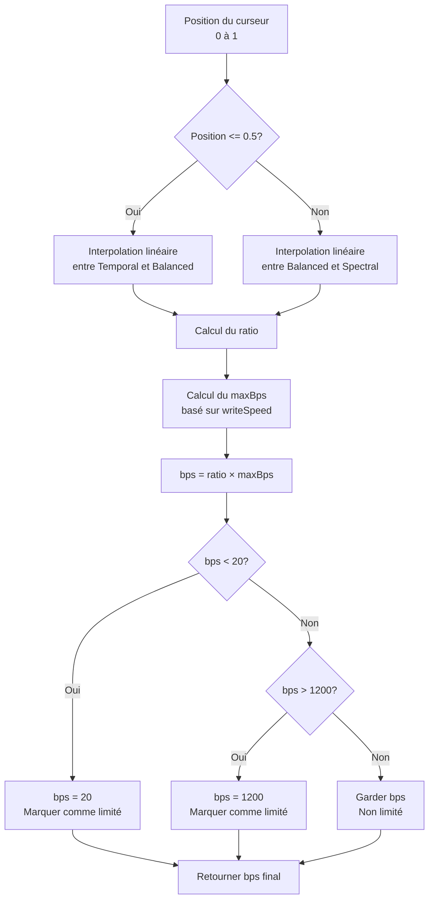
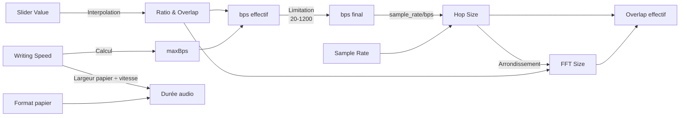

# Plan d'implémentation du mode « Résolution » par curseur (v 0.12)

## 1. Introduction et contexte

Ce document présente le plan d'implémentation du nouveau mode « Résolution » par curseur pour Sp3ctraGen v0.12. Cette évolution majeure vise à simplifier l'interface utilisateur tout en offrant un contrôle précis sur le compromis entre résolution temporelle et résolution fréquentielle.

### 1.1 Contexte actuel

Actuellement, Sp3ctraGen utilise un système basé sur les "bins par seconde" (bps) où :
- L'utilisateur saisit directement une valeur numérique de bps (par défaut: 150)
- Un préréglage d'overlap est sélectionné (Low, Medium, High)
- La FFT Size est calculée automatiquement

### 1.2 Problématique

Bien que fonctionnel, le système actuel présente plusieurs inconvénients :
- La relation entre bps et qualité du spectrogramme n'est pas intuitive pour les utilisateurs
- Les valeurs optimales varient selon les cas d'usage sans guide clair
- Absence de garantie que la résolution ne dépasse pas les capacités physiques d'impression

## 2. Exigences pour le nouveau mode

### 2.1 Principe fondamental

Remplacer la saisie numérique directe des bps par un **curseur unique** permettant à l'utilisateur de choisir le compromis entre résolution temporelle et résolution fréquentielle, tout en garantissant des contraintes physiques d'impression.

### 2.2 Contraintes techniques

1. La densité temporelle générée (bins/s) ne doit pas excéder la résolution horizontale imprimable :  
   maxBps = ⌊(800/2.54) × writeSpeed⌋

2. La durée audio représentée doit obéir strictement à :  
   durée (s) = largeur papier (cm) / writeSpeed (cm/s)

### 2.3 Paramètres d'entrée

| Nom | Unité | Source UI | Description |
|-----|-------|-----------|-------------|
| `paperFormat` | enum | Liste | **A4_Portrait**, **A3_Landscape** |
| `writeSpeed` | cm s⁻¹ | Champ de saisie | **0.1 → 40** |
| `sampleRate` | Hz | WAV | Fréquence d'échantillonnage |
| `sliderValue` | 0–1 | Curseur | 0 = Temporal, 1 = Spectral |

### 2.4 Largeur utile selon format

| paperFormat | paperWidth_cm |
|-------------|---------------|
| A4_Portrait | 21.0 |
| A3_Landscape | 42.0 |

### 2.5 Ancres du curseur

| Ancre | `sliderValue` | ratio `r×maxBps` | `overlap` |
|-------|---------------|------------------|-----------|
| Temporal | 0 | *rᴛ* = 0.26 | 0.30 |
| Balanced | 0.5 | *rᴍ* = 0.16 | 0.75 |
| Spectral | 1 | *rˢ* = 0.085 | 0.92 |

## 3. Plan d'implémentation

### 3.1 Modification des constantes

Ajout des nouvelles constantes dans `include/SharedConstants.h` :

```cpp
// Constantes pour la résolution d'impression
#define PRINTER_DPI                  800.0
#define INCH_TO_CM                   2.54

// Constantes pour les ancres du curseur "Resolution"
#define RESOLUTION_TEMPORAL_RATIO    0.26
#define RESOLUTION_BALANCED_RATIO    0.16
#define RESOLUTION_SPECTRAL_RATIO    0.085

#define RESOLUTION_TEMPORAL_OVERLAP  0.30
#define RESOLUTION_BALANCED_OVERLAP  0.75
#define RESOLUTION_SPECTRAL_OVERLAP  0.92

// Limites pour les bins par seconde
#define MIN_BINS_PER_SECOND          20.0
#define MAX_BINS_PER_SECOND          1200.0

// Largeurs de papier pour les différents formats (cm)
#define A4_PORTRAIT_WIDTH_CM         21.0
#define A3_LANDSCAPE_WIDTH_CM        42.0
```

### 3.2 Extension de la classe SpectrogramSettingsCpp

#### 3.2.1 Ajout dans le fichier d'en-tête (`include/SpectrogramSettingsCpp.h`)

```cpp
// Déclaration des nouvelles propriétés et méthodes
public:
    // Méthodes pour le curseur Resolution
    double calculateMaxBps(double writingSpeed) const;
    double calculateBpsFromSlider(double sliderValue, double writingSpeed) const;
    double calculateOverlapFromSlider(double sliderValue) const;
    double getPaperWidthCm() const;
    double calculateAudioDuration() const;
    
    // Getter et setter pour la position du curseur
    double getResolutionSliderValue() const { return m_resolutionSliderValue; }
    void setResolutionSliderValue(double value) { m_resolutionSliderValue = value; }
    
    // Méthode pour vérifier si la limitation de résolution est atteinte
    bool isResolutionLimited() const { return m_isResolutionLimited; }

private:
    // Nouvelles propriétés 
    double m_resolutionSliderValue;
    mutable bool m_isResolutionLimited;
```

#### 3.2.2 Implémentation dans le fichier source (`src/SpectrogramSettingsCpp.cpp`)

```cpp
// Initialisation dans le constructeur
SpectrogramSettingsCpp::SpectrogramSettingsCpp()
    : // autres initialisations...
    , m_resolutionSliderValue(0.5) // Valeur initiale: Balanced
    , m_isResolutionLimited(false)
{
}

// Calcul du plafond physique maxBps
double SpectrogramSettingsCpp::calculateMaxBps(double writingSpeed) const
{
    // maxBps = ⌊(800/2.54) × writeSpeed⌋
    return floor((PRINTER_DPI / INCH_TO_CM) * writingSpeed);
}

// Obtenir la largeur du papier en fonction du format
double SpectrogramSettingsCpp::getPaperWidthCm() const
{
    if (m_pageFormat == Constants::PAGE_FORMAT_A4_PORTRAIT) {
        return A4_PORTRAIT_WIDTH_CM;
    } else {
        return A3_LANDSCAPE_WIDTH_CM;
    }
}

// Calcul de la durée audio
double SpectrogramSettingsCpp::calculateAudioDuration() const
{
    // durée (s) = largeur papier (cm) / writeSpeed (cm/s)
    return getPaperWidthCm() / m_writingSpeed;
}

// Calcul du bps à partir de la position du curseur
double SpectrogramSettingsCpp::calculateBpsFromSlider(double sliderValue, double writingSpeed) const
{
    double maxBps = calculateMaxBps(writingSpeed);
    double ratio;
    
    if (sliderValue <= 0.5) {
        // Interpolation linéaire entre Temporal (0) et Balanced (0.5)
        ratio = RESOLUTION_TEMPORAL_RATIO + 
                (sliderValue / 0.5) * (RESOLUTION_BALANCED_RATIO - RESOLUTION_TEMPORAL_RATIO);
    } else {
        // Interpolation linéaire entre Balanced (0.5) et Spectral (1.0)
        ratio = RESOLUTION_BALANCED_RATIO + 
                ((sliderValue - 0.5) / 0.5) * (RESOLUTION_SPECTRAL_RATIO - RESOLUTION_BALANCED_RATIO);
    }
    
    // Calculer le bps initial
    double bps = ratio * maxBps;
    
    // Vérifier les limites et signaler si la limitation est atteinte
    m_isResolutionLimited = (bps <= MIN_BINS_PER_SECOND || bps >= MAX_BINS_PER_SECOND);
    
    // Appliquer les limites (clamp)
    if (bps < MIN_BINS_PER_SECOND) {
        bps = MIN_BINS_PER_SECOND;
    } else if (bps > MAX_BINS_PER_SECOND) {
        bps = MAX_BINS_PER_SECOND;
    }
    
    return bps;
}

// Calcul de l'overlap à partir de la position du curseur
double SpectrogramSettingsCpp::calculateOverlapFromSlider(double sliderValue) const
{
    if (sliderValue <= 0.5) {
        // Interpolation linéaire entre Temporal (0) et Balanced (0.5)
        return RESOLUTION_TEMPORAL_OVERLAP + 
               (sliderValue / 0.5) * (RESOLUTION_BALANCED_OVERLAP - RESOLUTION_TEMPORAL_OVERLAP);
    } else {
        // Interpolation linéaire entre Balanced (0.5) et Spectral (1.0)
        return RESOLUTION_BALANCED_OVERLAP + 
               ((sliderValue - 0.5) / 0.5) * (RESOLUTION_SPECTRAL_OVERLAP - RESOLUTION_BALANCED_OVERLAP);
    }
}
```

### 3.3 Extension du générateur de spectrogramme

Exposer les nouvelles méthodes au QML dans `include/spectrogramgenerator.h` et `src/spectrogramgenerator.cpp` :

```cpp
// Dans le fichier .h
Q_INVOKABLE double calculateBpsFromSlider(double sliderValue, double writingSpeed);
Q_INVOKABLE double calculateOverlapFromSlider(double sliderValue);
Q_INVOKABLE bool isResolutionLimited();
Q_INVOKABLE double calculateAudioDuration();
Q_INVOKABLE double calculateMaxBps(double writingSpeed);

// Dans le fichier .cpp
double SpectrogramGenerator::calculateBpsFromSlider(double sliderValue, double writingSpeed)
{
    return m_settings.calculateBpsFromSlider(sliderValue, writingSpeed);
}

double SpectrogramGenerator::calculateOverlapFromSlider(double sliderValue)
{
    return m_settings.calculateOverlapFromSlider(sliderValue);
}

bool SpectrogramGenerator::isResolutionLimited()
{
    return m_settings.isResolutionLimited();
}

double SpectrogramGenerator::calculateAudioDuration()
{
    return m_settings.calculateAudioDuration();
}

double SpectrogramGenerator::calculateMaxBps(double writingSpeed)
{
    return m_settings.calculateMaxBps(writingSpeed);
}
```

### 3.4 Modification de l'interface utilisateur QML

Remplacer les contrôles actuels de bins/s et d'overlap dans `qml/sections/SpectrogramParameters.qml` :

```qml
// Remplacer le champ binsPerSecondField par un composant de curseur
Column {
    spacing: 10
    Layout.fillWidth: true
    Layout.columnSpan: parametersGrid.columns
    
    // En-tête avec titre et valeur calculée
    Row {
        width: parent.width
        spacing: 10
        
        ThemedLabel {
            text: "Resolution:"
            Layout.alignment: Qt.AlignLeft
        }
        
        ThemedLabel {
            id: binsPerSecondLabel
            text: binsPerSecondNumeric.toFixed(1) + " bins/s"
            Layout.alignment: Qt.AlignRight
        }
    }
    
    // Message d'avertissement pour la limitation de résolution
    ThemedLabel {
        id: resolutionLimitedLabel
        text: "Limited by print horizontal resolution"
        visible: false
        color: AppStyles.Theme.errorColor
        font.italic: true
        font.pixelSize: AppStyles.Theme.smallFontSize
        width: parent.width
    }
    
    // Slider avec marques pour les ancres
    Row {
        width: parent.width
        spacing: 5
        
        ThemedLabel {
            text: "Temporal"
            font.pixelSize: AppStyles.Theme.smallFontSize
        }
        
        Slider {
            id: resolutionSlider
            width: parent.width - 180
            from: 0
            to: 1
            value: 0.5 // Valeur initiale: Balanced
            stepSize: 0.01
            
            onValueChanged: {
                // Calculer le bps en fonction de la position du curseur
                var bps = spectrogramGenerator.calculateBpsFromSlider(value, writingSpeedNumeric);
                binsPerSecondNumeric = bps;
                
                // Afficher le message d'avertissement si la limitation est atteinte
                resolutionLimitedLabel.visible = spectrogramGenerator.isResolutionLimited();
                
                // Recalculer la FFT et l'overlap effectif
                updateCalculatedParameters();
                
                parametersChanged();
            }
            
            // Marques pour les trois ancres
            Rectangle {
                width: 2
                height: 10
                color: AppStyles.Theme.primaryColor
                x: 0
                y: parent.height
                anchors.bottom: parent.bottom
            }
            
            Rectangle {
                width: 2
                height: 10
                color: AppStyles.Theme.primaryColor
                x: parent.width * 0.5
                y: parent.height
                anchors.bottom: parent.bottom
            }
            
            Rectangle {
                width: 2
                height: 10
                color: AppStyles.Theme.primaryColor
                x: parent.width
                y: parent.height
                anchors.bottom: parent.bottom
            }
        }
        
        ThemedLabel {
            text: "Spectral"
            font.pixelSize: AppStyles.Theme.smallFontSize
        }
    }
    
    // Étiquettes explicatives
    Row {
        width: parent.width
        spacing: 10
        
        ThemedLabel {
            text: "Higher Temporal Resolution"
            font.pixelSize: AppStyles.Theme.smallFontSize
            width: parent.width / 2 - 5
            horizontalAlignment: Text.AlignLeft
        }
        
        ThemedLabel {
            text: "Higher Frequency Resolution"
            font.pixelSize: AppStyles.Theme.smallFontSize
            width: parent.width / 2 - 5
            horizontalAlignment: Text.AlignRight
        }
    }
    
    // Affichage des valeurs dérivées
    GridLayout {
        columns: 2
        width: parent.width
        
        // FFT Size calculée (affichage uniquement)
        ThemedLabel {
            text: "FFT Size:"
            Layout.alignment: Qt.AlignRight
            font.pixelSize: AppStyles.Theme.smallFontSize
        }
        ThemedLabel {
            id: fftSizeCalculatedLabel
            text: "8192" // Valeur initiale
            Layout.preferredWidth: AppStyles.Theme.rightColumnWidth
            Layout.alignment: Qt.AlignLeft
            font.pixelSize: AppStyles.Theme.smallFontSize
        }
        
        // Overlap effectif calculé (affichage uniquement)
        ThemedLabel {
            text: "Effective Overlap:"
            Layout.alignment: Qt.AlignRight
            font.pixelSize: AppStyles.Theme.smallFontSize
        }
        ThemedLabel {
            id: overlapEffectifLabel
            text: "0.922" // Valeur initiale
            Layout.preferredWidth: AppStyles.Theme.rightColumnWidth
            Layout.alignment: Qt.AlignLeft
            font.pixelSize: AppStyles.Theme.smallFontSize
        }
        
        // Durée audio calculée (affichage uniquement)
        ThemedLabel {
            text: "Audio Duration (s):"
            Layout.alignment: Qt.AlignRight
            font.pixelSize: AppStyles.Theme.smallFontSize
        }
        ThemedLabel {
            id: audioDurationLabel
            text: "8.4" // Valeur initiale
            Layout.preferredWidth: AppStyles.Theme.rightColumnWidth
            Layout.alignment: Qt.AlignLeft
            font.pixelSize: AppStyles.Theme.smallFontSize
        }
    }
}

// Fonction pour mettre à jour les paramètres calculés
function updateCalculatedParameters() {
    // Calculer l'overlap à partir de la position du curseur
    var newOverlap = spectrogramGenerator.calculateOverlapFromSlider(resolutionSlider.value);
    
    // Calculer la FFT size et l'overlap effectif
    var sampleRate = 192000; // Valeur par défaut (sera remplacée par le vrai sample rate)
    var hopSize = sampleRate / binsPerSecondNumeric;
    var diviseur = 1.0 - newOverlap;
    var calculatedFft = hopSize / diviseur;
    
    // Arrondir à la puissance de 2 supérieure
    var powerOf2 = 1;
    while (powerOf2 < calculatedFft) {
        powerOf2 *= 2;
    }
    
    // Mettre à jour l'affichage de la FFT calculée
    fftSizeCalculatedLabel.text = powerOf2.toString();
    
    // Calculer l'overlap effectif
    var effectiveOverlap = 1.0 - (hopSize / powerOf2);
    overlapEffectifLabel.text = effectiveOverlap.toFixed(4);
    
    // Calculer et afficher la durée audio
    var audioDuration = spectrogramGenerator.calculateAudioDuration();
    audioDurationLabel.text = audioDuration.toFixed(2);
}

// Connecter la modification de la vitesse d'écriture au recalcul des paramètres
writingSpeedField.onValueEdited: {
    // Mettre à jour les paramètres calculés lorsque la vitesse d'écriture change
    updateCalculatedParameters();
    
    // Recalculer les bins/s car maxBps dépend de la vitesse d'écriture
    var bps = spectrogramGenerator.calculateBpsFromSlider(resolutionSlider.value, writingSpeedNumeric);
    binsPerSecondNumeric = bps;
    
    // Vérifier si la limitation est atteinte après changement de vitesse d'écriture
    resolutionLimitedLabel.visible = spectrogramGenerator.isResolutionLimited();
    
    parametersChanged();
}
```

### 3.5 Suppression des contrôles redundants

Supprimer les contrôles de préréglage d'overlap qui sont maintenant intégrés dans le curseur.

## 4. Flux de calcul

### 4.1 Calcul du bps à partir du curseur



### 4.2 Relation entre les paramètres



## 5. Scénarios de test

### 5.1 Scénario nominal

Vérifier que les valeurs de bps générées correspondent au tableau fourni pour différentes vitesses d'écriture et positions du curseur.

| writeSpeed (cm s⁻¹) | Temporal | Balanced | Spectral |
|---------------------|----------|----------|----------|
| 0.1 | 20 | 20 | 20 |
| 0.2 | 20 | 20 | 20 |
| 0.5 | 41 | 25 | 20 |
| 1 | 82 | 50 | 27 |
| 2 | 164 | 101 | 53 |
| 3 | 245 | 151 | 80 |
| 5 | 409 | 252 | 134 |
| 10 | 819 | 504 | 268 |
| 15 | 1200 | 756 | 402 |
| 20 | 1200 | 1008 | 535 |
| 30 | 1200 | 1200 | 803 |
| 40 | 1200 | 1200 | 1071 |

### 5.2 Scénario de limitation

Vérifier que:
- Les valeurs de bps sont correctement limitées à l'intervalle [20, 1200]
- Le message d'avertissement s'affiche lorsque la limitation est atteinte
- Le comportement est cohérent pour toutes les positions du curseur

### 5.3 Scénario de calcul FFT

Vérifier que:
- La FFT size est correctement calculée et arrondie à la puissance de 2 supérieure
- L'overlap effectif est calculé avec précision
- L'affichage est mis à jour en temps réel lors du déplacement du curseur

### 5.4 Scénario de durée audio

Vérifier que:
- La durée audio respecte strictement la formule : durée (s) = largeur papier (cm) / writeSpeed (cm/s)
- Le changement de format papier met correctement à jour la durée audio

## 6. Considérations d'implémentation

### 6.1 Précision des calculs

- Utiliser des types à virgule flottante double précision pour tous les calculs
- Appliquer l'arrondi à l'entier inférieur (floor) uniquement pour la valeur finale de maxBps
- Formater les valeurs affichées avec une précision appropriée (1 décimale pour bps, 4 décimales pour overlap)

### 6.2 Optimisation des performances

- Éviter de recalculer les paramètres trop fréquemment lors du déplacement du curseur
- Potentiellement ajouter un délai minimal entre les mises à jour pour les déplacements rapides du curseur

### 6.3 Considérations d'interface utilisateur

- S'assurer que le curseur est suffisamment large pour permettre une sélection précise
- Ajouter des marques visuelles claires pour les trois positions d'ancrage
- Fournir un retour visuel immédiat sur les valeurs dérivées

### 6.4 Compatibilité ascendante

- Maintenir la propriété binsPerSecondNumeric pour assurer la compatibilité avec le code existant
- S'assurer que les projets existants utilisant des valeurs directes de bps sont correctement chargés

## 7. Calendrier d'implémentation

1. Modification des constantes et structures (1 jour)
2. Implémentation des nouvelles méthodes de calcul (2 jours)
3. Création de l'interface utilisateur du curseur (2 jours)
4. Tests et ajustements (2 jours)
5. Documentation et finalisation (1 jour)

Durée totale estimée: 8 jours ouvrables

---

*Document créé le 14 mai 2025*