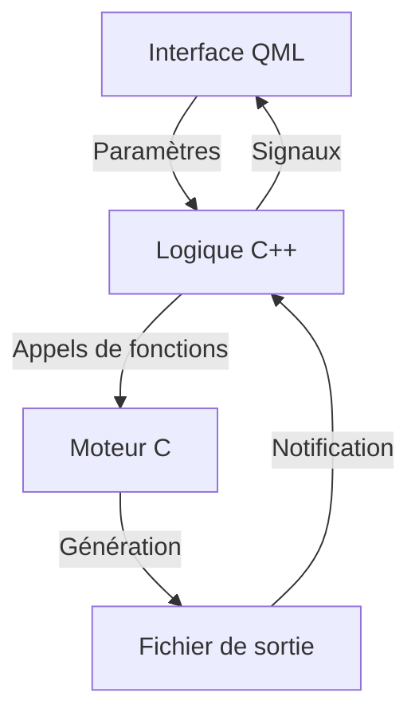

# Vue d'ensemble du projet Sp3ctraGen

## Introduction et objectifs du projet

Sp3ctraGen est une application de génération de spectrogrammes haute qualité basée sur Qt Quick. Ce projet est un portage de l'application CISYNTH_App originale développée en SwiftUI. L'objectif principal est de fournir un outil performant et précis pour la génération de spectrogrammes à partir de fichiers audio, avec une attention particulière portée à la qualité d'impression et à la lisibilité par scanner.

Les objectifs principaux du projet sont:

1. **Génération de spectrogrammes haute qualité** - Produire des spectrogrammes avec une résolution fréquentielle et temporelle optimale
2. **Support de formats multiples** - Générer des spectrogrammes en format raster (PNG) et vectoriel (PDF)
3. **Optimisation pour l'impression** - Assurer une qualité d'impression à 800 DPI avec des dimensions physiques précises
4. **Interface utilisateur réactive** - Fournir une interface utilisateur intuitive et réactive
5. **Traitement multithreadé** - Permettre le traitement en arrière-plan sans bloquer l'interface utilisateur
6. **Prévisualisation en temps réel** - Offrir une prévisualisation du spectrogramme avant la génération finale

## Structure générale du projet

Le projet Sp3ctraGen est organisé selon une structure claire qui sépare les différentes préoccupations:

```
Sp3ctraGen/
├── include/                  # Fichiers d'en-tête C++
│   ├── SharedConstants.h     # Constantes partagées entre C et C++
│   ├── Constants.h           # Constantes C++ (utilise SharedConstants.h)
│   ├── QmlConstants.h        # Exposition des constantes à QML
│   ├── VisualizationStrategy.h # Interface de stratégie
│   ├── RasterVisualizationStrategy.h # Stratégie pour PNG
│   └── VectorVisualizationStrategy.h # Stratégie pour PDF
├── src/                      # Fichiers source C++
│   ├── spectral_common.h     # Constantes et définitions C
│   ├── spectral_*.c          # Moteur de traitement du signal en C
│   ├── VisualizationStrategy.cpp # Implémentation de la classe de base
│   ├── RasterVisualizationStrategy.cpp # Implémentation de la stratégie PNG
│   └── VectorVisualizationStrategy.cpp # Implémentation de la stratégie PDF
├── qml/                      # Fichiers QML pour l'interface utilisateur
│   ├── components/           # Composants QML réutilisables
│   │   ├── AnimatedButton.qml # Bouton avec animations
│   │   └── ValidatedTextField.qml # Champ de texte avec validation
│   ├── main.qml              # Interface principale
│   └── minimal_main.qml      # Interface simplifiée
├── scripts/                  # Scripts utilitaires
│   ├── build.sh              # Script de compilation
│   ├── run.sh                # Script d'exécution
│   └── debug.sh              # Script de débogage
└── doc/                      # Documentation
    ├── README.md             # Documentation principale
    └── dev/                  # Documentation pour les développeurs
```

## Interactions entre les composants

L'architecture de Sp3ctraGen est basée sur une séparation claire entre trois couches distinctes:

### 1. Interface utilisateur (QML)

La couche d'interface utilisateur est implémentée en QML et est responsable de:
- Présenter l'interface graphique à l'utilisateur
- Collecter les paramètres de génération du spectrogramme
- Afficher les prévisualisations et les résultats
- Communiquer avec la couche logique métier via des appels de méthodes et des liaisons de propriétés

### 2. Logique métier (C++)

La couche de logique métier est implémentée en C++ et sert d'intermédiaire entre l'interface utilisateur et le moteur de traitement:
- Validation des paramètres d'entrée
- Coordination des opérations de génération
- Gestion des tâches asynchrones
- Implémentation des stratégies de visualisation
- Communication avec l'interface utilisateur via des signaux et des propriétés notifiables

### 3. Moteur de traitement (C)

Le moteur de traitement est implémenté en C et est responsable des opérations intensives de calcul:
- Chargement et prétraitement des fichiers audio
- Analyse FFT et traitement spectral
- Génération des images de spectrogramme
- Optimisations pour l'impression et la numérisation

Le flux de données typique dans l'application suit le chemin suivant:



## Guide de démarrage rapide pour les développeurs

### Prérequis

Pour compiler et exécuter Sp3ctraGen, vous aurez besoin de:

1. **Qt 5.15 ou supérieur**
   ```bash
   brew install qt@5
   ```

2. **Bibliothèques de traitement du signal et d'image**
   ```bash
   brew install fftw cairo libsndfile
   ```

3. **Outils de développement**
   ```bash
   brew install bear # Optionnel, pour générer compile_commands.json
   ```

### Compilation

Vous pouvez compiler l'application de plusieurs façons:

#### Avec les scripts fournis

```bash
# Compiler l'application
scripts/build.sh

# Exécuter l'application
scripts/run.sh

# Déboguer l'application
scripts/debug.sh
```

#### En ligne de commande

```bash
cd Sp3ctraGen
/opt/homebrew/opt/qt@5/bin/qmake -spec macx-clang CONFIG+=debug CONFIG+=qml_debug
make -j8
```

### Structure du code

Pour comprendre rapidement le projet, voici les fichiers clés à examiner:

1. **Interface utilisateur principale**: `qml/main.qml` et `qml/main_with_preview.qml`
2. **Classe principale C++**: `include/SpectrogramGenerator.h` et `src/SpectrogramGenerator.cpp`
3. **Stratégies de visualisation**: `include/VisualizationStrategy.h` et ses implémentations
4. **Moteur de traitement**: `src/spectral_generator.c`, `src/spectral_fft.c`
5. **Constantes et paramètres**: `include/SharedConstants.h`

### Flux de travail de développement

1. Modifier les fichiers source selon les besoins
2. Compiler avec `scripts/build.sh`
3. Exécuter avec `scripts/run.sh`
4. Déboguer avec `scripts/debug.sh` si nécessaire

Pour plus de détails sur chaque composant, veuillez consulter les documents spécifiques dans la documentation.